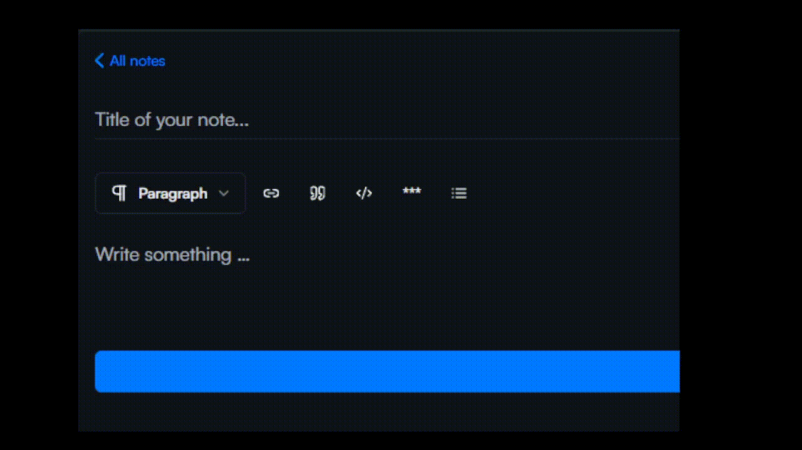

# Link Extension for React

Hello, i made a custom extension for the link node. With this custom extension, you can easily custom your modal when the user type his link. Like this : 



> The extension don't come with a built-in modal, you need to create yours. This is the goal of this library, you are free to create your own modal and your own logic to create a node link !

> The demo website is coming soon...

## Installation

```bash
npm install tiptap-link-extension-for-react
```

## Requirments 

You need to also download the Link extension from Tiptap team since our library is based on this : 

```bash
npm install @tiptap/extension-link
```

## Setup

1. Imports both libraries at the top of your file : 


```typescript
import { EditorContent, useEditor } from "@tiptap/react";
import LinkExtensionReact from "tiptap-link-extension-for-react";
import Link from "@tiptap/extension-link";
```

2. Setup your editor instance
```javascript
const editor = useEditor({
  extension: {
    Link,
    LinkExtensionReact,
    // other extensions...
  }
})
```

3. Create a url state, the show modal state and the onChange function
```javascript
const [url, setUrl] = useState("");
const [isPreviewLinkModal, setPreviewLinkModal] = useState(false);

const handleUrlChange = (event: ChangeEvent<HTMLInputElement>) => {
  setUrl(event.target.value);
};

```

4. Create your custom modal in which there will be the url input and some action buttons. Insert the card in the showPreviewLinkModal state.  My default modal is based on Shadcn-ui : 

```javascript
{isPreviewLinkModal && 
  <Card className="modal absolute top-10 p-0 w-fit">
    <CardContent className="modal-content space-x-2 flex px-3 py-1.5">
      <div className="relative">
        <Input
          className="w-48"
          type="text"
          placeholder="https://example.com..."
          value={url}
          onChange={handleUrlChange}
        />
      </div>

      <Button
        size="icon"
        onClick={() => setPreviewLinkModal(false)}
        className="bg-red-500 hover:bg-red-500/80 text-white"
      >
        <X className="size-5" />
      </Button>
      <CopyButton
        textToCopy={url}
        className="bg-gray-500 hover:bg-gray-500/80 text-white"
      />

      <Button size="icon" onClick={insertLink} className="text-white">
        <CornerDownRight className="size-5" />
      </Button>
    </CardContent>
  </Card>
}
```

5. Create your functions when a user click to add a link and when a user submit his link

```javascript
// When a user click to show the modal which there will be the input
const openSetLinkModal = () => {
  if (editor.state.selection.empty) {
    alert("Please select some text first.");
  } else {
    const previousLink = getHrefFromLinkMarkInRange({
      editorState: editor.state,
      selection: editor.state.selection,
    });
    setUrl(previousLink);
    setPreviewLinkModal(true);
  }
};

// When a user click to submit his link and replace the paragraph node by a link node
const insertLink = () => {
  editor.commands.replaceSelectionWithLink(url);
  setPreviewLinkModal(false);
  setUrl("");
};
```

6. In your toolbar, pass the openSetLinkModal function and add a toggle button like this : 

```javascript
"use client";

import { ToggleGroup } from "@/components/ui/toggle-group";
import type { Editor } from "@tiptap/react";
import {
	Link2,
} from "lucide-react";
import { Toggle } from "../ui/toggle";

interface Props {
	editor: Editor;
	openSetLinkModal?: () => void;
}
const TiptapToolbar = ({ editor, openSetLinkModal }: Props) => {
	return (
		<ToggleGroup type="single" className="justify-start overflow-x-auto">
			<Toggle pressed={editor.isActive("link")} onClick={openSetLinkModal}>
				<Link2 className="size-4" />
			</Toggle>
		</ToggleGroup>
	);
};

export default TiptapToolbar;

```